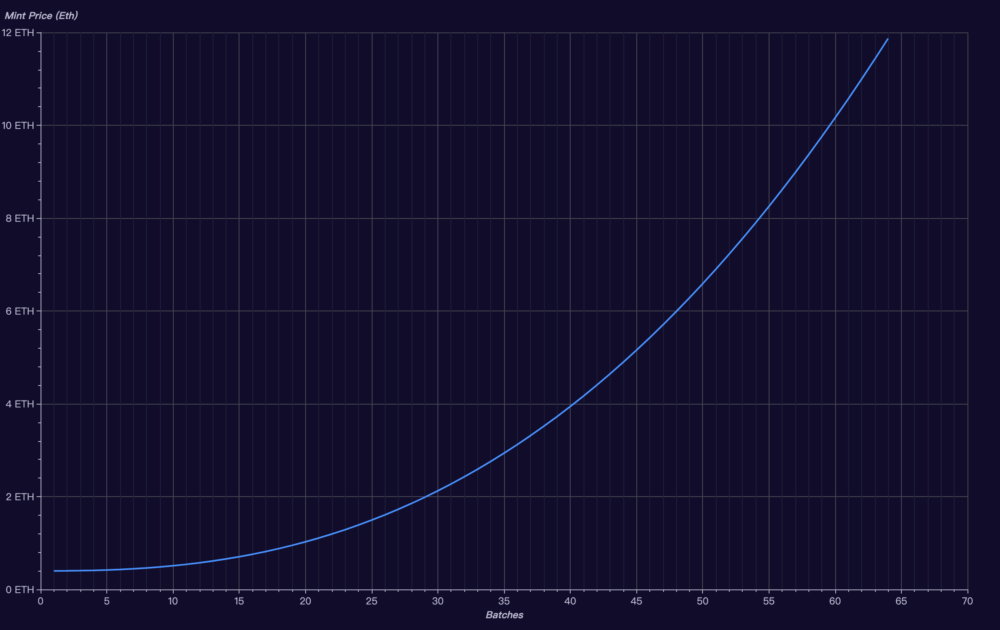

# Upcoming ShibaBits

## Reading Tips

> Woof ! ! ! You're a geeky blockchain enthusiast, If you read this unpublished article.  
I'm glad to tell you about the __Sneaky ICO Mint Plan__ .  
You have the opportunity to pre-mint the __ShibaBits__ at this moment of reading this tips.  

Ethereum Minting Address: [0x1fE5332052220FEcBd010Dc40f455B6c06025823](https://etherscan.io/address/0x1fE5332052220FEcBd010Dc40f455B6c06025823)  
Total Supply: 512 ShibaBit  
Start and End date: First Come First Served    
Mint Price: 0.2 ETH per ShibaBit 

> Please send Ethereum only from addresses able to receive ShibaBits ERC-721 token (e.g. not directly from exchanges). By sending Ethereum to this address, you agree to all terms in the [WoofPaper V2](https://github.com/shytoshikusama/woofwoofpaper/raw/main/SHIBA_INU_WOOF_WOOF.pdf)

## NFT Overview

Name: ShibaBits  
Symbol: ShibaBits  
Supply: 32,000 ShibaBit   
Blockchain platform: Etherscan (ETH)  
Contract: [_TBD_](#)  
  

### What are the ShibaBits?
The ShibaBits are 32,000 unique 3D characters, created by a random-generative algorithm, that registered on the Ethereum blockchain. Each ShibaBit has its own style and identity based ShibaInu.  
The NFT contract the governs ownership is a standard ERC-721 that works with any compatible service or exchange. Also included in the contract is a custom marketplace that supports like-kind trading of up to 128 ShibaBits per transaction, along with all the standard buy, bid and ask transactions.

## ShibaBits Mint Plan

Ethereum Minting Address: [0x1fE5332052220FEcBd010Dc40f455B6c06025823](https://etherscan.io/address/0x1fE5332052220FEcBd010Dc40f455B6c06025823)  
Total Supply: 31,488 ShibaBit  
Mint Batch: 64  
Batch Size: 492 ShibaBit   
Start and End date: _It will be announced after this announcement published._  
Mint Price Chart: _As shown in the figure below._
 

> Please send Ethereum only from addresses able to receive ShibaBits ERC-721 token (e.g. not directly from exchanges). By sending Ethereum to this address, you agree to all terms in the [WoofPaper V2](https://github.com/shytoshikusama/woofwoofpaper/raw/main/SHIBA_INU_WOOF_WOOF.pdf).

Shiba Inu Team

